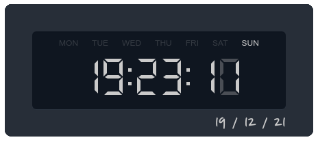

# Clock.exe

- The clock I use on Windows.
<p>
            I wanted a clock (for dual-screen) instead of looking in the
            taskbar.
           So I made one.
</p>

## Features :

<ul>
            <li> - AM/PM ✅</li>
            <li> - Start on startup ✅</li>
            <li> - Switch Theme ❌ ( I like Dark ! )</li>
</ul>
       
## ScreenShot



## Install

```
# Clone this repository
$ git clone https://github.com/H97-Git/Clock

# Go into the repository
$ cd Clock

# Install dependencies
$ npm install / yarn install

# Run the app
$ npm start / yarn start
```
